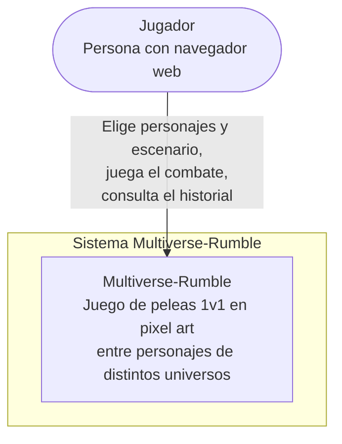
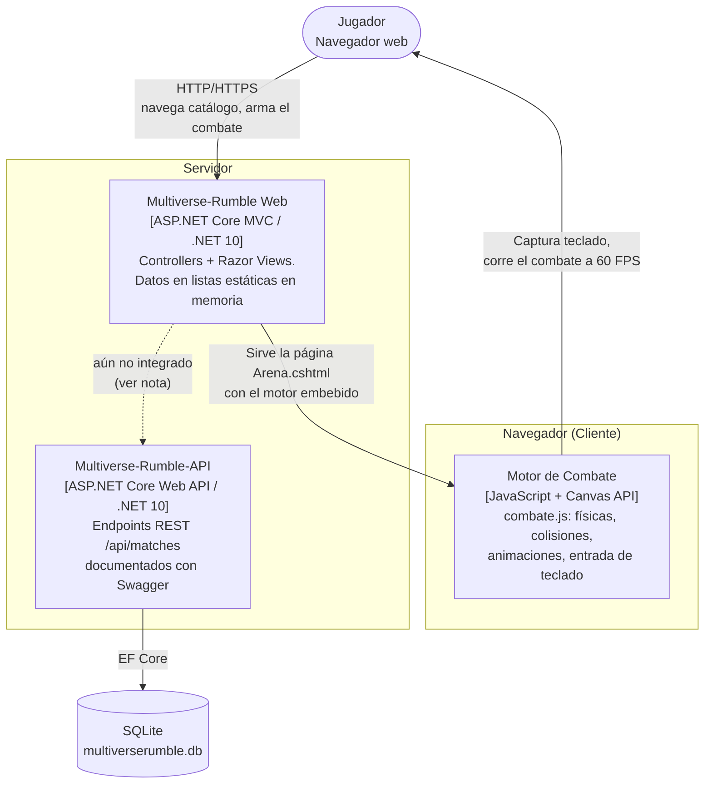
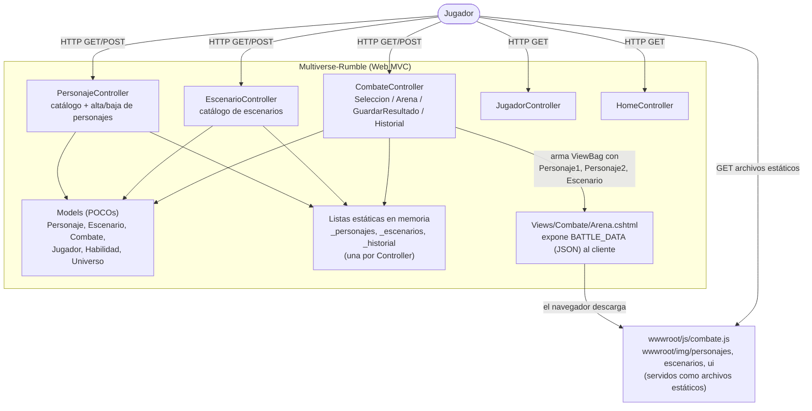
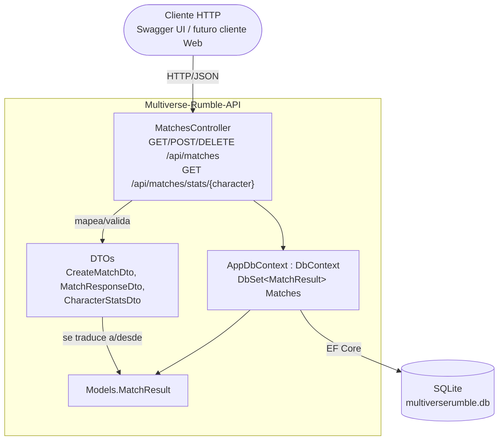

# Arquitectura de Multiverse-Rumble — Modelo C4

Este documento describe la arquitectura de **Multiverse-Rumble** usando el Modelo C4, en sus
tres primeros niveles de detalle progresivo. Todos los diagramas están escritos como código
(Mermaid) para versionarse junto con el resto del repositorio y renderizarse automáticamente
al ver este archivo en GitHub.

> Actualizado a la versión final del proyecto (Unidad 3 — Actividad 40). Refleja el estado
> real del código en este momento, no un diseño aspiracional.

---

## Nivel 1 — Contexto

**¿Para quién es este diagrama?** Para cualquier persona sin conocimiento técnico que quiera
entender qué hace el sistema y quién lo usa, sin entrar en detalles de tecnología.

**¿Qué pregunta responde?** *¿Qué es Multiverse-Rumble y quién interactúa con él?*

**Audiencia:** cualquier persona interesada en el proyecto (evaluadores no técnicos, otros
alumnos, el propio jugador).

---

## Nivel 2 — Contenedores

**¿Para quién es este diagrama?** Para desarrolladores o arquitectos que necesitan entender
las piezas técnicas grandes del sistema y cómo se comunican, sin ver el código interno de
cada una.

**¿Qué pregunta responde?** *¿Cuáles son las piezas técnicas principales de Multiverse-Rumble
y cómo interactúan hoy?*

**Nota importante — estado real de la integración:** `Multiverse-Rumble-API` es un proyecto
independiente y funcional (persiste partidas en SQLite vía EF Core, expone `GET/POST/DELETE
/api/matches` y `GET /api/matches/stats/{character}`, documentado con Swagger), pero **el sitio
MVC todavía no lo consume**: `CombateController.GuardarResultado` guarda el resultado del
combate en su propia lista estática en memoria (`_historial`), no vía HTTP contra la API. La
flecha punteada del diagrama representa esa integración pendiente, documentada como decisión
consciente en `ADR-API-REST` ("sienta la base para futuras features... sin rediseñar la capa
de datos"). Conectar `Web → Api` es el siguiente paso natural de evolución de la arquitectura.

**Audiencia:** desarrolladores y el arquitecto de la solución, para validar que las piezas
grandes del sistema y sus fronteras de comunicación (o falta de ellas) están correctamente
identificadas.

---

## Nivel 3 — Componentes

Dado que el sistema tiene dos contenedores de servidor con lógica propia, se documentan los
componentes de **ambos**.

### 3.1 — Componentes de `Multiverse-Rumble` (Web MVC)

**¿Qué pregunta responde?** *¿Cómo resuelve el sitio MVC una petición, desde el controlador
hasta la vista que entrega el motor de combate al navegador?*

**Nota:** no existe una capa `Data/` separada ni un `DbContext`: cada Controller declara y
gestiona su propia lista `static` en memoria (decisión documentada en `ADR-docs/adr-01.txt` y
`ADR-docs/adr-02.txt` como deuda técnica consciente — ver sección de ATAM).

### 3.2 — Componentes de `Multiverse-Rumble-API`

**¿Qué pregunta responde?** *¿Qué hay dentro de Multiverse-Rumble-API y cómo se resuelve una
petición de principio a fin?*

**Audiencia (ambos diagramas de Nivel 3):** el desarrollador que da mantenimiento directo al
código de cada proyecto.

---

## Declaración de uso de IA

Estos diagramas fueron elaborados con apoyo de un asistente de inteligencia artificial
(Claude, Anthropic) para estructurar el modelo C4 y la sintaxis Mermaid a partir de la
arquitectura real del proyecto (código de `Controllers`, `Models`, `combate.js` y
`Multiverse-Rumble-API` inspeccionado directamente). El análisis de qué construir, las
decisiones de arquitectura y el desarrollo del código fuente son de autoría y responsabilidad
exclusiva del autor del repositorio.
