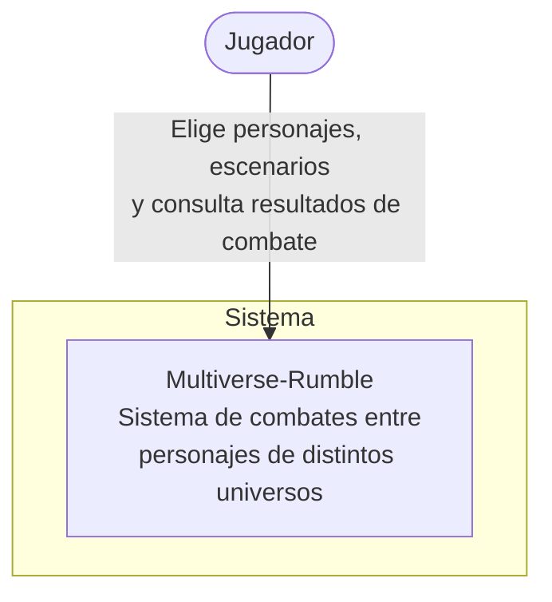

# Arquitectura de Multiverse-Rumble — Modelo C4

Este documento describe la arquitectura de **Multiverse-Rumble** usando el Modelo C4, en tres niveles de detalle progresivo. Todos los diagramas están escritos como código (Mermaid) para versionarse junto con el resto del repositorio.

---

## Nivel 1 — Contexto

**¿Para quién es este diagrama?** Para cualquier persona sin conocimiento técnico que quiera entender qué hace el sistema y quién lo usa, sin entrar en detalles de tecnología.

**¿Qué pregunta responde?** *¿Qué es Multiverse-Rumble y quién interactúa con él?*

