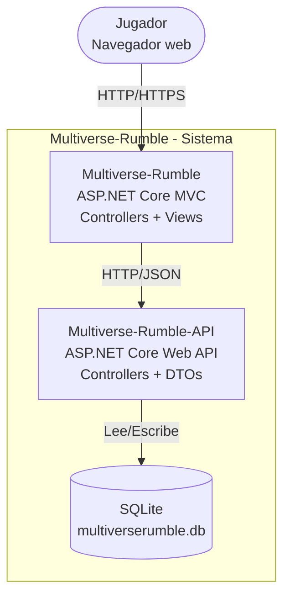
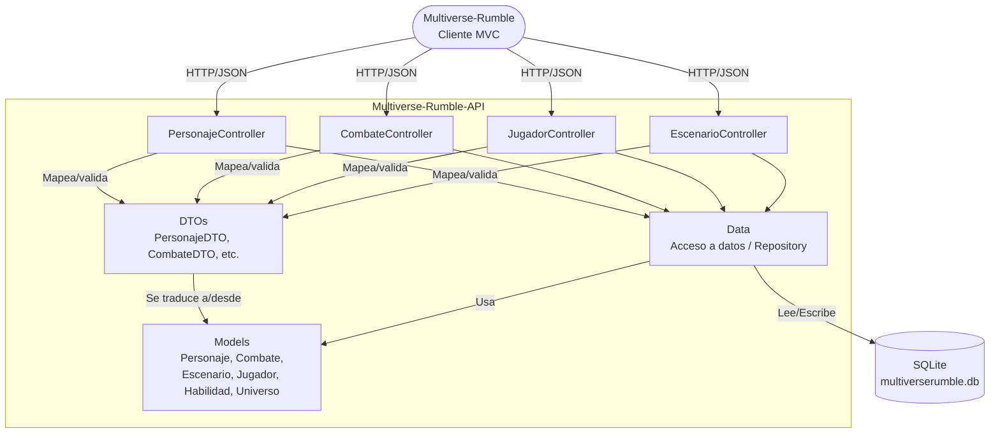

# Arquitectura de Multiverse-Rumble — Modelo C4

Este documento describe la arquitectura de **Multiverse-Rumble** usando el Modelo C4, en tres niveles de detalle progresivo. Todos los diagramas están escritos como código (Mermaid) para versionarse junto con el resto del repositorio.

---

## Nivel 1 — Contexto

**¿Para quién es este diagrama?** Para cualquier persona sin conocimiento técnico que quiera entender qué hace el sistema y quién lo usa, sin entrar en detalles de tecnología.

**¿Qué pregunta responde?** *¿Qué es Multiverse-Rumble y quién interactúa con él?*

## Nivel 2 — Contenedores

**¿Para quién es este diagrama?** Para desarrolladores o arquitectos que necesitan entender las piezas técnicas grandes del sistema y cómo se comunican, sin ver el código interno de cada una.

**¿Qué pregunta responde?** *¿Cuáles son las piezas técnicas principales de Multiverse-Rumble y cómo interactúan?*

## Nivel 3 — Componentes

**¿Para quién es este diagrama?** Para el desarrollador que trabaja directamente dentro de `Multiverse-Rumble-API`, y necesita ver cómo colaboran controladores, DTOs y la capa de datos.

**¿Qué pregunta responde?** *¿Qué hay dentro de Multiverse-Rumble-API y cómo se resuelve una petición de principio a fin?*

---

## Declaración de uso de IA

Estos diagramas fueron elaborados con apoyo de una IA (Claude, Anthropic) para estructurar el modelo C4 y la sintaxis Mermaid, a partir de la arquitectura real del proyecto. El contenido fue revisado y ajustado por el autor del repositorio.

---

## Notas de proceso

Este archivo se construyó en tres commits separados sobre la rama `diagramas`, uno por cada nivel, para reflejar el proceso de documentación de la arquitectura.
